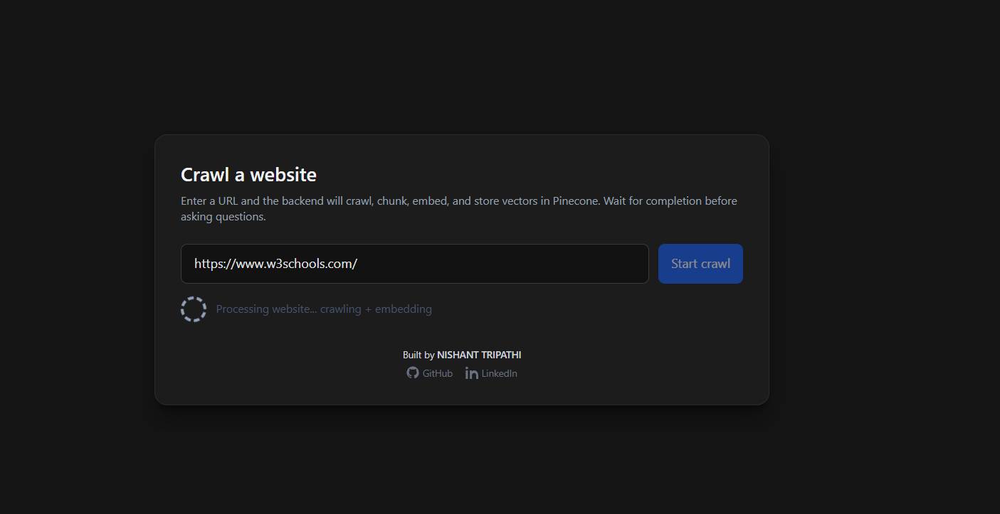
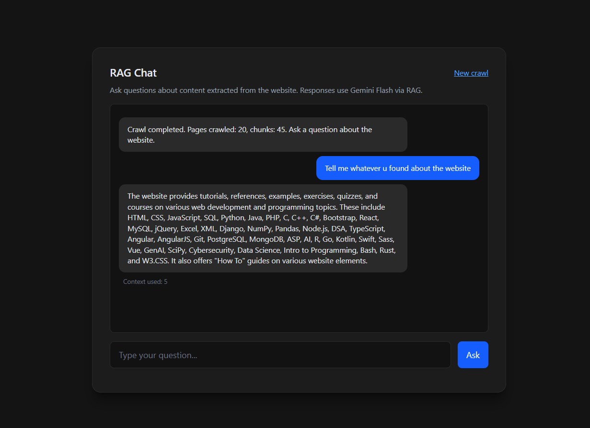

# 🔍 RAG-Based Search Engine for Any Website

A powerful full-stack web application that allows users to **crawl any website**, convert its content into vector embeddings, and **chat with the website** using AI. The system ensures complete session isolation, fast crawling, accurate RAG responses, and a smooth UI built with modern technologies.

---

## 🔗 Live Deployment

| Component | Link |
| :--- | :--- |
| **Frontend** | [**Click here to visit App**](https://vector-crawl-engine-6ilz.vercel.app/) |
| **Backend** | [**API Server Link**](https://vectorcrawl-engine.onrender.com) |

---

## 🛠️ Tech Stack

### **Frontend**
* **Framework:** React.js + Vite
* **Styling:** TailwindCSS
* **HTTP Client:** Axios
* **State Management:** React Hooks

### **Backend**
* **Runtime:** Node.js
* **Framework:** Express.js
* **Crawling:** Custom BFS Crawler + Cheerio

### **Vector & AI**
* **Vector Database:** Pinecone (Namespaced storage)
* **Embeddings:** Jina AI (`jina-embeddings-v2-base-en-768`)
* **LLM:** Google Gemini Flash

---

## ✨ Features

### 1. 🔎 Advanced Website Crawler
* **BFS-Based:** Systematically crawls internal links.
* **Clean Extraction:** Removes ads, scripts, and styles using Cheerio.
* **Smart Chunking:** Splits text into semantic blocks optimized for LLMs.

### 2. 🧬 AI Embeddings & Storage
* **Jina AI:** Generates high-quality 768-dimensional vectors.
* **Pinecone Namespaces:** Uses **Session IDs** to isolate data. This prevents one user's crawl from mixing with another's.

### 3. 🤖 RAG Chat (Retrieval-Augmented Generation)
* **Google Gemini Flash:** Provides fast, accurate answers.
* **No Hallucinations:** Answers are strictly grounded in the retrieved website context.

### 4. 🎨 Modern UI/UX
* **State-Driven:** Clear flow from `Crawl Stage` → `Chat Stage`.
* **Dark Mode:** Aesthetic, developer-friendly dark theme.
* **Feedback:** Real-time loading indicators and system summaries.

---

## 📸 Screenshots

### 🏠 Crawl Interface


### 💬 Chat Interface


---

## 🚦 Application Workflow

1.  **🔍 Crawl:** User enters a URL. The backend crawls the site and extracts text.
2.  **📌 Session ID:** A unique UUID (`sessionId`) is generated for the crawl.
3.  **🗄️ Store:** Text is chunked, embedded, and stored in a specific Pinecone namespace.
4.  **💬 Chat:** The frontend sends the `question` + `sessionId`. The backend retrieves relevant chunks and Gemini answers.

---

## 📥 Installation & Setup

### 1️⃣ Clone the Repository
```bash
git clone [https://github.com/NishantTripathi21/VectorCrawl-Engine](https://github.com/NishantTripathi21/VectorCrawl-Engine)
cd VectorCrawl-Engine
```

### 2️⃣ Create Environment Files

**A. Backend Configuration**
Create a file named `.env` inside the `backend/` folder:
```env
PORT=5000
ALLOWED_ORIGIN=http://localhost:5173

# API Keys
JINA_API_KEY=your_jina_key_here
PINECONE_API_KEY=your_pinecone_key_here
PINECONE_INDEX_NAME=your_index_name
GEMINI_API_KEY=your_gemini_key_here
```

**B. Frontend Configuration**
Create a file named `.env.local` inside the `frontend/` folder:
```env
VITE_APP_URL=http://localhost:5000/
```

### 3️⃣ Install Dependencies & Run

**🚀 Frontend Setup**
```bash
cd frontend
npm install
npm run dev
```
*Frontend runs on: `http://localhost:5173`*

**🔧 Backend Setup**
Open a new terminal:
```bash
cd backend
npm install
npm run dev
```
*Backend runs on: `http://localhost:5000`*

---

## 🧑‍💻 Folder Structure

```text
/backend
 ├── controllers/       # Logic for Crawl and RAG endpoints
 ├── routes/            # API Route definitions
 ├── crawler/           # BFS Crawler logic
 ├── processing/        # Chunking & Embedding utilities
 ├── utils/             # Helper functions
 ├── db/                # Pinecone connection & queries
 └── server.js          # Entry point

/frontend
 ├── pages/             # CrawlPage and ChatPage
 ├── components/        # Reusable UI (Loader, MessageBubble)
 ├── services/          # API calls (Axios)
 ├── App.jsx            # Main Router/State
 ├── index.css          # Tailwind imports
 └── main.jsx           # React Root
```

---

## 🤝 Contribution

We welcome contributions! Please follow these steps:

1.  **Fork** the repository.
2.  **Clone** your fork:
    ```bash
    git clone [https://github.com/NishantTripathi21/VectorCrawl-Engine](https://github.com/NishantTripathi21/VectorCrawl-Engine)
    ```
3.  **Create a Branch:**
    ```bash
    git checkout -b feature-new-ui
    ```
4.  **Commit your changes:**
    ```bash
    git commit -m "Added a new loading animation"
    ```
5.  **Push** to your fork:
    ```bash
    git push origin feature-new-ui
    ```
6.  Open a **Pull Request** on the original repository.

---

## 👨‍💻 Developers

**Nishant Tripathi**
* *Role:* Full Stack Developer
* *Tech:* React, Node.js, GenAI